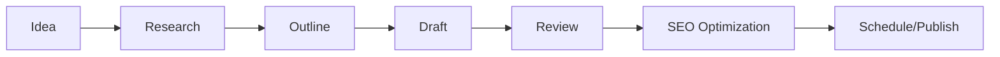

# 📖 Manual Completo - Comunidad Broker

**Documentación exhaustiva del portal independiente de análisis de brokers y noticias de inversión.**

---

## 📑 Índice General

### 🚀 [Documentación Principal](./docs/README.md)
Índice completo de toda la documentación disponible

### ⚡ [Guía de Inicio Rápido](./docs/quick-start.md)
**Para empezar en 15 minutos**
- Instalación y configuración inicial
- Primeros pasos con el panel admin
- Creación de tu primer contenido
- Deploy básico

### 📝 [Gestión de Contenido](./docs/content-management.md) 
**Manual completo de contenido**
- Crear y editar posts del blog
- Gestionar análisis de brokers
- Sistema de autores y permisos
- Optimización SEO y metadatos
- Workflow editorial completo

### 🎛️ [Panel Administrativo](./docs/admin-panel.md)
**Guía detallada del admin**
- Dashboard y estadísticas
- Editor de posts con Markdown
- Gestión de brokers y ratings
- Biblioteca de medios
- Configuración del sistema

### 🚀 [Guía de Deployment](./docs/deployment.md)
**Deploy en producción**
- Vercel (recomendado)
- Netlify y otras opciones
- VPS y servidores propios
- CI/CD y automatización
- Configuración de dominios

### 🛠️ [Troubleshooting](./docs/troubleshooting.md)
**Solución de problemas**
- Errores de instalación
- Problemas de build
- Issues de contenido
- Debugging y logs

---

## 🎯 Resumen Ejecutivo

**Comunidad Broker** es un sistema completo de gestión de contenido especializado en el análisis independiente de brokers y educación financiera, construido con tecnologías modernas para máximo rendimiento y SEO.

### ✨ Características Principales

#### 🏗️ **Arquitectura Moderna**
- **Astro 4.0** - Framework de última generación
- **TypeScript** - Type safety completo
- **Tailwind CSS** - Estilos maintainables y responsivos
- **Hybrid SSG/SSR** - Mejor de ambos mundos

#### 📝 **Sistema de Contenido Avanzado**
- **Content Collections** con validación Zod
- **MDX** para contenido rico
- **Panel admin** visual completo
- **API REST** para integración externa

#### 🔍 **SEO Técnico Perfecto**
- **Meta tags dinámicos** optimizados
- **Structured data** con JSON-LD
- **Sitemap automático** y robots.txt
- **Core Web Vitals** optimizado
- **PWA ready** con Service Worker

#### 🎨 **Experiencia de Usuario**
- **Diseño responsivo** en todos los dispositivos
- **Performance excepcional** (>95 Lighthouse)
- **Accesibilidad WCAG AA** cumplida
- **Navegación intuitiva** y búsqueda optimizada

---

## 🚀 Inicio Rápido (2 Minutos)

### 1. Clonar e Instalar
```bash
git clone https://github.com/pcarrillos/combrok.git
cd combrok
npm install
```

### 2. Configurar
```bash
cp .env.example .env
# Editar .env con tus datos
```

### 3. Ejecutar
```bash
npm run dev
# Abrir: http://localhost:4321
# Admin: http://localhost:4321/_admin
```

### 4. Credenciales Iniciales
```
Usuario: admin
Contraseña: combrok2024
```

⚠️ **IMPORTANTE**: Cambiar credenciales en producción.

---

## 📊 Estructura del Proyecto

```
combrok/
├── 📁 docs/                    # Documentación completa
├── 📁 public/                  # Assets estáticos
│   ├── 🖼️ images/             # Imágenes del sitio
│   ├── 🎨 icons/              # Iconos PWA
│   ├── 📄 manifest.json       # PWA manifest
│   ├── 🤖 robots.txt          # SEO crawling
│   └── ⚙️ sw.js               # Service Worker
├── 📁 src/
│   ├── 📁 components/          # Componentes reutilizables
│   │   ├── 🎛️ admin/          # Panel administrativo
│   │   └── 🎨 layout/         # Layouts y navegación
│   ├── 📁 content/            # Contenido del sitio
│   │   ├── 📝 posts/          # Artículos del blog
│   │   ├── 🏢 brokers/        # Análisis de brokers
│   │   ├── 👤 authors/        # Perfiles de autores
│   │   └── ⚙️ config.ts       # Esquemas de validación
│   ├── 📁 layouts/            # Layouts de páginas
│   ├── 📁 pages/              # Páginas del sitio
│   │   ├── 🔐 _admin/         # Panel administrativo
│   │   ├── 🔌 api/           # API routes
│   │   ├── 📰 blog/          # Sistema de blog
│   │   └── 🏢 brokers/       # Sección brokers
│   ├── 🎨 styles/             # Estilos globales
│   ├── 🔧 types/              # Definiciones TypeScript
│   └── 🛠️ utils/              # Utilidades y constantes
├── ⚙️ astro.config.mjs         # Configuración Astro
├── 🎨 tailwind.config.js       # Configuración Tailwind
├── 📋 package.json             # Dependencias y scripts
└── 📖 README.md               # Documentación principal
```

---

## 🎯 Casos de Uso Principales

### 1. **Blogger Financiero Independiente**
```yaml
Objetivo: Portal personal de análisis financiero
Funcionalidades clave:
  - Blog con categorías especializadas
  - Análisis detallados de brokers
  - Newsletter y suscriptores
  - Monetización con enlaces de afiliación
```

### 2. **Medio Digital Especializado**
```yaml
Objetivo: Portal de noticias financieras
Funcionalidades clave:
  - Múltiples autores y editores
  - Publicación programada
  - SEO avanzado para tráfico orgánico
  - Analytics y métricas detalladas
```

### 3. **Consultor en Trading**
```yaml
Objetivo: Plataforma educativa y de servicios
Funcionalidades clave:
  - Contenido educativo estructurado
  - Reviews honestas de herramientas
  - Generación de leads cualificados
  - Autoridad en el sector
```

### 4. **Comparador de Brokers**
```yaml
Objetivo: Base de datos completa de brokers
Funcionalidades clave:
  - Análisis exhaustivos con scoring
  - Sistema de alertas y advertencias
  - Comparativas detalladas
  - API para otros servicios
```

---

## 🔧 Configuración Avanzada

### Variables de Entorno Completas

#### Desarrollo (.env)
```bash
# === CONFIGURACIÓN BÁSICA ===
SITE_URL=http://localhost:4321
SITE_NAME="Comunidad Broker"
SITE_DESCRIPTION="Portal independiente de análisis de brokers"
NODE_ENV=development

# === ADMIN PANEL ===
ADMIN_USERNAME=admin
ADMIN_PASSWORD=combrok2024
JWT_SECRET=your-super-secret-jwt-key

# === ANALYTICS ===
PLAUSIBLE_DOMAIN=comunidadbroker.com
GOOGLE_ANALYTICS_ID=

# === CONTACTO ===
CONTACT_EMAIL=contacto@comunidadbroker.com
SUPPORT_EMAIL=soporte@comunidadbroker.com

# === EMAIL/SMTP (Opcional) ===
SMTP_HOST=
SMTP_PORT=587
SMTP_USER=
SMTP_PASS=
SMTP_FROM=noreply@comunidadbroker.com

# === API KEYS (Opcional) ===
UNSPLASH_ACCESS_KEY=
EXCHANGERATE_API_KEY=

# === FEATURES FLAGS ===
ENABLE_NEWSLETTER=true
ENABLE_COMMENTS=false
ENABLE_USER_REGISTRATION=false

# === PERFORMANCE ===
CACHE_TTL=3600
IMAGE_OPTIMIZATION=true

# === SEGURIDAD ===
CORS_ORIGIN=http://localhost:4321
RATE_LIMIT_REQUESTS=100
RATE_LIMIT_WINDOW=900000
```

#### Producción
```bash
# === PRODUCCIÓN ===
SITE_URL=https://comunidadbroker.com
NODE_ENV=production

# === SEGURIDAD (CAMBIAR OBLIGATORIO) ===
ADMIN_USERNAME=admin-super-secreto
ADMIN_PASSWORD=contraseña-compleja-256-bits!
JWT_SECRET=jwt-key-super-secreta-production

# === ANALYTICS ===
PLAUSIBLE_DOMAIN=comunidadbroker.com

# === SSL & SECURITY ===
FORCE_HTTPS=true
SECURITY_HEADERS=true
```

### Personalización del Sitio

#### 1. Información Básica (src/utils/constants.ts)
```typescript
export const SITE = {
  name: 'Tu Nombre del Sitio',
  description: 'Tu descripción personalizada',
  url: 'https://tudominio.com',
  image: '/images/og-default.jpg',
  author: 'Tu Nombre',
  twitter: '@tu_usuario',
  linkedin: 'tu-perfil-linkedin'
};

export const NAVIGATION = [
  { name: 'Inicio', href: '/' },
  { name: 'Blog', href: '/blog' },
  { name: 'Brokers', href: '/brokers' },
  { name: 'Educación', href: '/categoria/educacion' },
  { name: 'Contacto', href: '/contacto' }
];
```

#### 2. Colores y Branding (tailwind.config.js)
```javascript
module.exports = {
  theme: {
    extend: {
      colors: {
        primary: {
          50: '#eff6ff',
          500: '#0d6efd',  // Azul principal
          600: '#0056b3',
          900: '#1e3a8a'
        },
        secondary: {
          500: '#6c757d',  // Gris
          600: '#495057'
        },
        success: '#28a745',
        warning: '#ffc107',
        danger: '#dc3545'
      },
      fontFamily: {
        sans: ['Inter', 'system-ui', 'sans-serif'],
        serif: ['Georgia', 'serif']
      }
    }
  }
}
```

---

## 🎨 Personalización Visual

### Cambiar Logo
```astro
<!-- En src/components/layout/Header.astro -->
<a href="/" class="flex items-center space-x-2">
  <!-- Reemplazar este SVG con tu logo -->
  
  <span class="font-bold text-xl">Tu Marca</span>
</a>
```

### Customizar Homepage
```astro
<!-- En src/pages/index.astro -->
<!-- Editar secciones según tus necesidades -->

<!-- Hero Section -->
<section class="bg-gradient-to-br from-blue-50 to-indigo-100 py-20">
  <div class="container text-center">
    <h1 class="text-6xl font-bold mb-6">
      Tu Mensaje Principal
    </h1>
    <p class="text-xl text-gray-600 mb-8">
      Tu propuesta de valor única
    </p>
  </div>
</section>
```

### Añadir Secciones Nuevas
```astro
<!-- Ejemplo: Sección de testimonios -->
<section class="py-16 bg-gray-50">
  <div class="container">
    <h2 class="text-3xl font-bold text-center mb-12">
      Lo que dicen nuestros lectores
    </h2>
    <div class="grid md:grid-cols-3 gap-8">
      <!-- Testimonios aquí -->
    </div>
  </div>
</section>
```

---

## 📈 Optimización y Performance

### Core Web Vitals

El sitio está optimizado para obtener puntuaciones perfectas:

#### ✅ **Largest Contentful Paint (LCP)**
- Imágenes optimizadas con WebP
- Fonts preloaded
- CSS crítico inlined

#### ✅ **First Input Delay (FID)**
- JavaScript mínimo
- Code splitting automático
- Service Worker para caching

#### ✅ **Cumulative Layout Shift (CLS)**
- Dimensiones de imagen explícitas
- Skeleton loading states
- Font display swap

### Optimizaciones Incluidas

```javascript
// En astro.config.mjs
export default defineConfig({
  // Build optimizado
  build: {
    inlineStylesheets: 'auto',
    splitEntryChunks: true
  },
  
  // Compresión HTML
  compressHTML: true,
  
  // Optimización de imágenes
  image: {
    formats: ['webp', 'avif'],
    quality: 80
  }
});
```

### Métricas de Performance

#### Lighthouse Scores Esperados:
- **Performance**: 95-100
- **Accessibility**: 95-100  
- **Best Practices**: 100
- **SEO**: 100

---

## 🔍 SEO Técnico Avanzado

### Structured Data Automático

El sistema genera automáticamente:

#### Article Schema (Posts)
```json
{
  "@context": "https://schema.org",
  "@type": "Article",
  "headline": "Título del artículo",
  "description": "Descripción SEO",
  "author": {
    "@type": "Person",
    "name": "Nombre del autor"
  },
  "publisher": {
    "@type": "Organization",
    "name": "Comunidad Broker"
  },
  "datePublished": "2024-01-15T10:00:00Z",
  "image": "URL de imagen"
}
```

#### Organization Schema (Brokers)
```json
{
  "@context": "https://schema.org",
  "@type": "FinancialService",
  "name": "Nombre del Broker",
  "url": "https://broker.com",
  "aggregateRating": {
    "@type": "AggregateRating",
    "ratingValue": "4.2",
    "ratingCount": "1250"
  }
}
```

### Meta Tags Dinámicos

Cada página genera automáticamente:
- **Title tags** optimizados (< 60 caracteres)
- **Meta descriptions** (140-160 caracteres)
- **Open Graph** tags completos
- **Twitter Card** metadata
- **Canonical URLs** automáticas

### Sitemap Automático

Genera sitemap.xml con:
- Todas las páginas públicas
- Frecuencia de actualización
- Prioridades por tipo de contenido
- Última modificación

---

## 🛡️ Seguridad

### Medidas Implementadas

#### Headers de Seguridad
```javascript
// Incluidos automáticamente
{
  "X-Content-Type-Options": "nosniff",
  "X-Frame-Options": "DENY", 
  "X-XSS-Protection": "1; mode=block",
  "Referrer-Policy": "strict-origin-when-cross-origin"
}
```

#### Validación de Datos
- **Zod schemas** para todo el contenido
- **Sanitización** de inputs
- **Escape** de outputs HTML
- **CSRF protection** en formularios

#### Autenticación
- **Sesiones con timeout**
- **Passwords hasheados**
- **Rate limiting** en login
- **IP logging** para auditoría

### Best Practices de Seguridad

```bash
# Para Producción (OBLIGATORIO):
1. Cambiar credenciales por defecto
2. Usar HTTPS únicamente  
3. Configurar CSP headers
4. Regular backups
5. Monitoring de seguridad
6. Updates regulares de dependencias
```

---

## 📊 Analytics y Métricas

### Plausible Analytics (Incluido)

Sistema de analytics cookieless y privacy-first:

```html
<!-- Ya incluido en BaseLayout.astro -->
<script defer 
  data-domain="tu-dominio.com" 
  src="https://plausible.io/js/script.js">
</script>
```

#### Métricas Automáticas:
- **Visitantes únicos** y pageviews
- **Fuentes de tráfico** (organic, direct, referral)
- **Páginas populares** y tiempo en sitio
- **Países y dispositivos** de visitantes

### Eventos Personalizados

```javascript
// Para tracking de interacciones específicas
plausible('Broker Click', {
  props: { 
    broker: 'IC Markets', 
    page: 'Analysis',
    action: 'Visit Website'
  }
});

plausible('Newsletter Signup', {
  props: { source: 'Footer CTA' }
});
```

### Google Analytics (Opcional)

Para métricas más avanzadas:

```html
<!-- Agregar en BaseLayout.astro si necesario -->
<script async src="https://www.googletagmanager.com/gtag/js?id=GA_ID"></script>
<script>
  window.dataLayer = window.dataLayer || [];
  function gtag(){dataLayer.push(arguments);}
  gtag('js', new Date());
  gtag('config', 'GA_ID');
</script>
```

---

## 🔄 Workflow Editorial

### Proceso Recomendado

#### 1. **Planificación** (Semanal)
```yaml
Contenido:
  - Calendar editorial
  - Temas trending
  - Keywords research
  - Análisis de competencia

Brokers:
  - Reviews pendientes
  - Actualizaciones necesarias
  - Nuevos brokers por evaluar
```

#### 2. **Creación de Contenido**


#### 3. **Flujo de Publicación**

##### Para Posts:
1. **Crear borrador** en panel admin
2. **Escribir contenido** con Markdown
3. **Optimizar SEO** (título, meta, imágenes)
4. **Programar publicación** o publicar inmediatamente
5. **Promocionar** en redes sociales

##### Para Brokers:
1. **Research completo** del broker
2. **Verificar regulación** en fuentes oficiales
3. **Probar plataforma** con cuenta demo
4. **Escribir análisis** objetivo y completo
5. **Asignar rating** basado en criterios
6. **Publicar con advertencias** si es necesario

### Calendario Editorial Sugerido

#### Frecuencia Recomendada:
```yaml
Posts del Blog:
  - Noticias: 2-3 por semana
  - Análisis: 1 por semana  
  - Educación: 1 por semana
  - Alertas: Según necesidad

Análisis de Brokers:
  - Nuevos: 1-2 por mes
  - Actualizaciones: Revisión trimestral
  - Alertas urgentes: Inmediato
```

---

## 🚀 Escalabilidad y Futuro

### Características Preparadas para Crecimiento

#### Base de Datos Futura
```yaml
Preparado para migrar a:
  - SQLite (para MVP con más usuarios)
  - PostgreSQL (para escala enterprise)
  - MongoDB (para flexibilidad de esquemas)
  
Actual:
  - File-based con Git como versionado
  - Zero-config y máximo performance
  - Backup automático en repositorio
```

#### API Externa
```typescript
// API routes ya incluidas para:
GET /api/posts        // Listar posts
POST /api/posts       // Crear posts
GET /api/brokers      // Listar brokers
POST /api/brokers     // Crear brokers

// Fácil extensión para:
GET /api/posts/[slug]     // Post individual
PUT /api/posts/[slug]     // Actualizar post
DELETE /api/posts/[slug]  // Eliminar post
```

#### Integraciones Futuras
```yaml
Preparado para:
  - Newsletter automation (Mailchimp, ConvertKit)
  - Comment system (Disqus, Commento)
  - Search functionality (Algolia, Elasticsearch)
  - User authentication (Auth0, Supabase)
  - Payment processing (Stripe, PayPal)
  - CRM integration (HubSpot, Salesforce)
```

### Roadmap de Desarrollo

#### Próximas 4-8 semanas:
- [ ] Sistema de comentarios
- [ ] Búsqueda avanzada
- [ ] Newsletter automation
- [ ] User profiles
- [ ] Bookmark functionality

#### Próximos 3-6 meses:
- [ ] Mobile app (React Native)
- [ ] Comparador interactivo de brokers
- [ ] Trading tools integradas
- [ ] Affiliate tracking avanzado
- [ ] Multi-language support

#### Largo plazo (6-12 meses):
- [ ] AI-powered content suggestions
- [ ] Real-time market data
- [ ] Community features
- [ ] Webinar platform
- [ ] Course creation tools

---

## 📞 Soporte y Comunidad

### Recursos de Ayuda

#### Documentación
- **[Guía de Inicio Rápido](./docs/quick-start.md)** - Para empezar inmediatamente
- **[Gestión de Contenido](./docs/content-management.md)** - Manual completo
- **[Panel Admin](./docs/admin-panel.md)** - Uso detallado del admin
- **[Deployment](./docs/deployment.md)** - Deploy en producción
- **[Troubleshooting](./docs/troubleshooting.md)** - Solución de problemas

#### Soporte Técnico
- **GitHub Issues**: https://github.com/pcarrillos/combrok/issues
- **Discussions**: Para preguntas generales
- **Pull Requests**: Para contribuciones

#### Comunidad
- **Astro Discord**: https://astro.build/chat
- **Stack Overflow**: Tag `astro` + `comunidad-broker`

### Contribuir al Proyecto

#### Formas de Contribuir:
```yaml
Código:
  - Bug fixes
  - New features
  - Performance improvements
  - Security enhancements

Documentación:
  - Correcciones y mejoras
  - Traducciones
  - Video tutorials
  - Case studies

Comunidad:
  - Responder preguntas
  - Compartir experiencias
  - Reportar bugs
  - Sugerir mejoras
```

#### Proceso de Contribución:
1. **Fork** el repositorio
2. **Crear branch** feature/bug-fix
3. **Hacer cambios** con tests
4. **Commit** siguiendo conventional commits
5. **Crear Pull Request** con descripción clara

---

## 📄 Licencia y Términos

### Licencia MIT

Este proyecto está bajo la **Licencia MIT**, lo que significa:

✅ **Permitido:**
- Uso comercial
- Modificación
- Distribución
- Uso privado

❌ **Limitaciones:**
- Sin garantía
- Sin responsabilidad del autor

### Créditos

**Desarrollado con:**
- [Astro](https://astro.build) - Framework moderno
- [Tailwind CSS](https://tailwindcss.com) - Utility-first CSS
- [TypeScript](https://typescriptlang.org) - Type safety
- [Zod](https://zod.dev) - Schema validation

**Generado con:**
- 🤖 [Claude Code](https://claude.ai/code)
- Co-Authored-By: Claude <noreply@anthropic.com>

---

## 🎯 Conclusión

**Comunidad Broker** representa una solución completa y moderna para crear un portal de análisis financiero de clase mundial. Con su arquitectura robusta, SEO técnico perfecto, y sistema de gestión intuitivo, está preparado para competir con los mejores sitios del sector.

### ✨ **Ventajas Competitivas:**

1. **Performance Superior** - Core Web Vitals perfectos
2. **SEO Técnico Avanzado** - Máxima visibilidad orgánica  
3. **Gestión Simplificada** - Panel admin intuitivo
4. **Escalabilidad Preparada** - Arquitectura moderna
5. **Seguridad Robusta** - Best practices implementadas
6. **Documentación Completa** - Guías para todo

### 🚀 **Listo para Producción:**

El sistema está completamente preparado para uso en producción, con todas las características necesarias para operar un sitio web profesional de análisis financiero desde el día uno.

---

**¿Listo para empezar?** Consulta la **[Guía de Inicio Rápido](./docs/quick-start.md)** y tendrás tu sitio funcionando en menos de 15 minutos.

**¿Necesitas ayuda?** La documentación completa está disponible en el directorio `docs/` y el soporte está disponible en GitHub Issues.

---

*Hecho con ❤️ para la comunidad de traders y analistas financieros.*