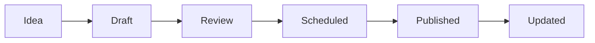

# 📝 Gestión de Contenido

Guía completa para crear, editar y gestionar todo el contenido en **Comunidad Broker**.

## 🗂️ Tipos de Contenido

### 1. **Posts del Blog** 📰
- Artículos educativos y análisis
- Noticias del mercado financiero
- Guías y tutoriales

### 2. **Análisis de Brokers** 🏢
- Reviews detalladas de brokers
- Comparativas y rankings
- Alertas de riesgo

### 3. **Autores** 👤
- Perfiles de escritores
- Información de contacto
- Bio y credenciales

## 📰 Gestión de Posts del Blog

### Crear Nuevo Post

#### Método 1: Panel Admin (Recomendado)
1. **Acceder**: http://localhost:4321/_admin
2. **Login**: con credenciales admin
3. **Nuevo Post**: Click en "Nuevo Post"
4. **Completar formulario**:

**Campos Obligatorios**:
```
✓ Título (máx. 60 caracteres)
✓ Descripción (140-160 caracteres)
✓ Contenido (Markdown)
✓ Categoría
✓ Autor
✓ Imagen principal + Alt text
```

**Campos Opcionales**:
```
• Título SEO personalizado
• Meta descripción SEO
• URL canónica
• Etiquetas (separadas por comas)
• Advertencias de riesgo
• Fecha de programación
• Prioridad (0-10)
• Post destacado (featured)
```

#### Método 2: Manual (Avanzado)
```bash
# Crear archivo
touch src/content/posts/mi-nuevo-post.mdx
```

**Estructura completa**:
```yaml
---
# Información Básica
title: "Cómo Elegir un Broker Confiable en 2024"
description: "Guía completa para seleccionar el broker perfecto. Aprende sobre regulación, costos, plataformas y factores clave para una decisión informada."
publishDate: 2024-01-15T10:00:00.000Z
updateDate: 2024-01-15T10:00:00.000Z

# Autoría y Categorización
author: "admin"
category: "educacion"  # noticias, analisis, educacion, alertas
readingTime: 8

# SEO Avanzado
seoTitle: "Guía 2024: Cómo Elegir el Mejor Broker Regulado"
seoDescription: "Descubre los 7 factores clave para elegir un broker confiable. Regulación, spreads, plataformas y más en nuestra guía experta 2024."
canonical: "https://comunidadbroker.com/blog/elegir-broker-2024"
noindex: false

# Media
image:
  src: "/images/posts/elegir-broker-2024.jpg"
  alt: "Trader analizando gráficos para elegir broker"
  caption: "La elección correcta del broker es fundamental"
  credit: "Unsplash"
ogImage: "/images/posts/elegir-broker-og.jpg"

# Taxonomías
tags: ["brokers", "educacion", "trading", "forex", "regulacion"]
topics: ["seleccion-broker", "trading-seguro"]
countries: ["españa", "mexico", "colombia"]
relatedBrokers: ["ic-markets", "xtb", "plus500"]

# Estado y Programación
status: "published"  # draft, scheduled, published
scheduledDate: 2024-02-01T09:00:00.000Z
featured: true
priority: 9

# Advertencias y Fuentes
warnings:
  - "El trading conlleva riesgo de pérdida de capital"
  - "Solo invierte lo que puedas permitirte perder"
disclaimer: "Este artículo es solo para fines educativos y no constituye asesoramiento financiero."

sources:
  - name: "Regulación ESMA sobre brokers"
    url: "https://esma.europa.eu/regulation"
    date: 2024-01-10T00:00:00.000Z
  - name: "Estadísticas FCA"
    url: "https://fca.org.uk/data"
    date: 2024-01-05T00:00:00.000Z

# Métricas (automáticas)
views: 0
shares: 0
---

# Cómo Elegir un Broker Confiable en 2024

La elección del broker correcto puede marcar la diferencia entre el éxito y el fracaso en el trading. En esta guía completa te explicamos los **7 factores clave** que debes considerar.

## ¿Por Qué Es Crucial Elegir Bien?

Un broker inadecuado puede resultar en:
- **Pérdida total** de tu capital
- **Costos excesivos** que erosionen ganancias
- **Problemas de ejecución** en momentos críticos
- **Restricciones** que limiten tu estrategia

## Los 7 Factores Clave

### 1. 🛡️ Regulación y Seguridad

**La regulación debe ser tu prioridad número uno.**

#### Reguladores de Confianza:
| Regulador | País | Protección |
|-----------|------|------------|
| **FCA** | Reino Unido | £85,000 FSCS |
| **CySEC** | Chipre | €20,000 ICF |
| **ASIC** | Australia | AU$500,000 |
| **BaFin** | Alemania | €100,000 |

⚠️ **Evita brokers sin regulación** o con licencias de países poco reconocidos.

### 2. 💰 Costos y Spreads

Los costos pueden variar dramáticamente:

#### Tipos de Costos:
- **Spreads**: Diferencia bid/ask
- **Comisiones**: Por operación
- **Swaps**: Costos overnight
- **Inactividad**: Tarifas por no uso

#### Ejemplo Comparativo:
```
Broker A: EUR/USD 0.8 pips + $0 comisión = $8/lote
Broker B: EUR/USD 0.3 pips + $3.5 comisión = $6.5/lote
```

### 3. 💻 Plataformas de Trading

#### Opciones Principales:
- **MetaTrader 4**: Estándar de la industria
- **MetaTrader 5**: Más avanzada
- **cTrader**: Moderna y profesional
- **Propias**: Pueden ofrecer ventajas únicas

#### Características Importantes:
✓ Estabilidad y velocidad
✓ Herramientas de análisis
✓ Expert Advisors (EAs)
✓ App móvil funcional

### 4. 📊 Instrumentos y Mercados

Considera qué puedes tradear:
- **Forex**: Major, minor, exotic pairs
- **CFDs**: Acciones, índices, commodities
- **Criptomonedas**: Bitcoin, altcoins
- **Otros**: Bonds, ETFs, futuros

### 5. ⚡ Apalancamiento

| Región | Forex | Índices | Acciones |
|--------|-------|---------|----------|
| **UE** | 30:1 | 20:1 | 5:1 |
| **UK** | 30:1 | 20:1 | 5:1 |
| **AU** | 30:1 | 20:1 | 5:1 |
| **Offshore** | 500:1+ | 200:1+ | 20:1+ |

⚠️ **Mayor apalancamiento = Mayor riesgo**

### 6. 🏦 Depósitos y Retiros

#### Factores a Evaluar:
- **Métodos disponibles**: Tarjeta, banco, e-wallets
- **Tiempos de procesamiento**
- **Comisiones por transacción**
- **Límites mínimos/máximos**

### 7. 🆘 Soporte al Cliente

#### Canales Importantes:
- **Live chat** 24/7
- **Teléfono** en horario extendido
- **Email** con respuesta rápida
- **Soporte en español**

## 🚩 Red Flags: Señales de Alerta

### Evita Brokers Que:
❌ **No tienen regulación** reconocida
❌ **Prometen ganancias** garantizadas
❌ **Ofrecen bonos** excesivos (términos imposibles)
❌ **Tienen quejas** frecuentes sobre retiros
❌ **Presionan agresivamente** para depositar
❌ **Cambian spreads** drásticamente sin aviso
❌ **No son transparentes** con costos

## 📋 Proceso de Evaluación

### Paso 1: Lista Inicial
1. **Crear shortlist** de 5-10 brokers regulados
2. **Verificar regulación** en sitios oficiales
3. **Descartar** los que no cumplan requisitos básicos

### Paso 2: Comparación Detallada
| Broker | Regulación | Min. Depósito | Spread EUR/USD | Comisión | Total/Lote |
|--------|------------|---------------|----------------|----------|------------|
| Broker A | FCA | $200 | 0.8 | $0 | $8 |
| Broker B | CySEC | $100 | 0.3 | $3.5 | $6.5 |
| Broker C | ASIC | $500 | 0.1 | $7 | $8 |

### Paso 3: Cuentas Demo
- **Abrir demos** con top 3 brokers
- **Probar por 2+ semanas**
- **Evaluar**:
  - Velocidad de ejecución
  - Slippage real
  - Estabilidad de plataforma
  - Calidad de datos

### Paso 4: Depósito Mínimo
- **Comenzar pequeño** ($50-200)
- **Probar proceso** completo depósito/retiro
- **Evaluar servicio** real vs. promesas

## 🎯 Recomendaciones por Perfil

### 👶 Principiantes
**Prioridades**:
- Regulación fuerte (FCA/CySEC)
- Depósito mínimo bajo
- Educación abundante
- Soporte en español
- Spreads fijos para previsibilidad

**Brokers Recomendados**: XTB, eToro, Plus500

### 📈 Traders Activos
**Prioridades**:
- Spreads muy bajos
- Ejecución rápida
- Apalancamiento flexible
- Herramientas avanzadas
- VPS gratuito

**Brokers Recomendados**: IC Markets, Pepperstone, FP Markets

### ⚡ Scalpers
**Prioridades**:
- Spreads desde 0.0 pips
- Ejecución instantánea
- Sin restricciones EA
- Servidores colocalizados
- Comisiones bajas

**Brokers Recomendados**: IC Markets Raw, Pepperstone Razor

### 🏛️ Swing/Position Traders
**Prioridades**:
- Swaps favorables
- Instrumentos variados
- Análisis fundamental
- Estabilidad long-term
- Research quality

**Brokers Recomendados**: IG, Saxo Bank, Interactive Brokers

## ❓ Preguntas Clave

Antes de elegir, pregunta:

1. **¿Cuáles son TODOS los costos?** (incluye spreads, comisiones, swaps, tarifas)
2. **¿Cómo están protegidos mis fondos?** (segregación, seguro, compensación)
3. **¿Puedo retirar dinero cuando quiera?** (procesos, tiempos, restricciones)
4. **¿Qué soporte ofrecen en español?** (horarios, canales, calidad)
5. **¿Hay restricciones en estrategias?** (scalping, EAs, hedging)
6. **¿Cómo es la ejecución real?** (slippage, requotes, velocidad)

## 📊 Herramientas de Verificación

### Verificar Regulación:
- **FCA**: https://register.fca.org.uk/
- **CySEC**: https://cysec.gov.cy/
- **ASIC**: https://asic.gov.au/
- **BaFin**: https://bafin.de/

### Verificar Quejas:
- **FPA**: ForexPeaceArmy
- **TrustPilot**: Reviews reales
- **Reddit**: r/Forex opiniones
- **Foros especializados**

## 🔄 Proceso de Cambio

### Si Necesitas Cambiar Broker:
1. **Abrir nueva cuenta** sin cerrar la anterior
2. **Probar con capital pequeño**
3. **Transferir gradualmente**
4. **Cerrar cuenta anterior** solo cuando estés seguro

### Documentación del Cambio:
- **Razones del cambio**
- **Comparativa de costos**
- **Historial de problemas**
- **Expectativas del nuevo broker**

## ✅ Checklist Final

### Antes de Depositar:
- [ ] Regulación verificada oficialmente
- [ ] Términos y condiciones leídos
- [ ] Estructura de costos clara
- [ ] Demo probada satisfactoriamente
- [ ] Soporte contactado y respondido
- [ ] Reviews independientes consultadas
- [ ] Proceso de retiro comprendido

### Red Flags Verificados:
- [ ] Sin promesas de ganancias garantizadas
- [ ] Sin presión de ventas agresiva
- [ ] Spreads estables durante noticias
- [ ] Transparencia total en costos
- [ ] Historial limpio de regulación

## 🎯 Conclusión

**La elección del broker es una decisión crucial** que afectará toda tu carrera de trading. No te apresures - dedica tiempo a investigar y probar.

### Principios Clave:
1. **Seguridad primero** - Regulación innegociable
2. **Costos transparentes** - Sin sorpresas ocultas
3. **Prueba antes** - Demo + depósito pequeño
4. **Soporte confiable** - Cuando lo necesites
5. **Crecimiento gradual** - Aumenta exposición lentamente

**¿Necesitas ayuda evaluando un broker específico?** Consulta nuestros [análisis detallados](/brokers) donde revisamos cada plataforma con criterios objetivos.

---

*Este contenido es solo para fines educativos. El trading conlleva riesgo de pérdida y no es adecuado para todos los inversores.*
```

### Categorías y Tags

#### Categorías Principales:
```yaml
# Usar exactamente estos valores
category: "noticias"    # Noticias del mercado
category: "analisis"    # Análisis técnico/fundamental  
category: "educacion"   # Guías y tutoriales
category: "alertas"     # Advertencias y riesgos
```

#### Tags Recomendados:
```yaml
# Trading General
tags: ["forex", "trading", "cfd", "inversiones"]

# Tipos de Análisis  
tags: ["análisis-técnico", "análisis-fundamental", "señales"]

# Instrumentos
tags: ["eurusd", "oro", "petróleo", "bitcoin", "sp500"]

# Educación
tags: ["principiantes", "estrategias", "gestión-riesgo", "psicología"]

# Brokers
tags: ["brokers", "regulación", "spreads", "comisiones"]

# Regiones
tags: ["españa", "méxico", "colombia", "argentina"]
```

### Estados y Programación

#### Estados Disponibles:
```yaml
status: "draft"       # Borrador (no visible)
status: "scheduled"   # Programado para fecha específica
status: "published"   # Publicado y visible
```

#### Programación Automática:
```yaml
# Para posts programados
status: "scheduled"
scheduledDate: 2024-02-15T09:00:00.000Z
publishDate: 2024-01-01T00:00:00.000Z  # Fecha de creación
```

## 🏢 Gestión de Análisis de Brokers

### Crear Nuevo Broker

#### Estructura Completa del Broker:
```bash
# Crear archivo
touch src/content/brokers/nombre-broker.mdx
```

**Plantilla completa**:
```yaml
---
# === INFORMACIÓN BÁSICA ===
name: "IC Markets"
logo: "/images/brokers/ic-markets.png"
website: "https://www.icmarkets.com"
foundedYear: 2007
parentCompany: "International Capital Markets Pty Ltd"

# === UBICACIÓN ===
countryOrigin: "Australia"
headquarters: "Sydney, Australia"
countriesOperating: ["Australia", "Seychelles", "Cyprus", "Bahamas"]
countriesRestricted: ["Estados Unidos", "Bélgica", "Canadá"]
languages: ["Inglés", "Español", "Chino", "Árabe", "Francés"]

# === REGULACIÓN ===
regulations:
  - entity: "ASIC"
    country: "Australia"
    licenseNumber: "335692"
    verified: true
    verificationDate: 2024-01-15T00:00:00.000Z
    url: "https://asic.gov.au/professionalpages/335692"
  - entity: "CySEC"
    country: "Chipre"
    licenseNumber: "362/18"
    verified: true
    verificationDate: 2024-01-15T00:00:00.000Z
    url: "https://cysec.gov.cy/"
isRegulated: true

# === INSTRUMENTOS ===
instruments:
  forex: true
  stocks: true
  indices: true
  commodities: true
  cryptocurrencies: true
  etfs: false
  bonds: false
  options: false
  futures: false
availableMarkets: 232

# === PLATAFORMAS ===
platforms:
  - name: "MetaTrader 4"
    type: "desktop"
    customPlatform: false
  - name: "MetaTrader 5"
    type: "desktop"
    customPlatform: false
  - name: "cTrader"
    type: "desktop"
    customPlatform: false
  - name: "WebTrader"
    type: "web"
    customPlatform: false

# === CONDICIONES DE TRADING ===
minDeposit: 200
maxLeverage: "1:500"
spreadsFrom: 0.0
averageSpread: 0.1
commissionType: "both"  # spread, commission, both
commissionDetails: "Desde $3.5 por lado en cuentas Raw Spread"

# === DEPÓSITOS Y RETIROS ===
depositMethods: ["Tarjeta de Crédito", "Transferencia Bancaria", "PayPal", "Skrill"]
withdrawalMethods: ["Tarjeta de Crédito", "Transferencia Bancaria", "PayPal"]
depositFees: "Gratis para la mayoría de métodos"
withdrawalFees: "Gratis para retiros superiores a $200"
processingTime:
  deposits: "Instantáneo a 24 horas"
  withdrawals: "24 horas a 5 días laborables"

# === TIPOS DE CUENTA ===
accountTypes: ["Standard", "Raw Spread", "cTrader"]
demoAccount: true
islamicAccount: true
copyTrading: true
socialTrading: false
educationCenter: true

# === EVALUACIÓN ===
rating: 4.6
trustScore: 92
userReviews: 15420
pros:
  - "Spreads extremadamente competitivos desde 0.0 pips"
  - "Regulación sólida por ASIC y CySEC"
  - "Excelente ejecución y velocidad"
  - "Amplia gama de plataformas"
cons:
  - "Depósito mínimo algo alto para principiantes"
  - "Comisiones en cuentas Raw Spread"
  - "Interface web podría ser más intuitiva"

# === SOPORTE ===
supportChannels:
  liveChat: true
  phone: true
  email: true
  localOffice: false
support247: false
supportQuality: "excellent"  # poor, average, good, excellent

# === ALERTAS Y RIESGOS ===
warnings: []  # Array de advertencias específicas
scamAlert: false
blacklisted: false
complaints: 23
riskLevel: "low"  # low, medium, high, extreme

# === SEO ===
seoTitle: "IC Markets Review 2024: Análisis Completo del Broker"
seoDescription: "Análisis detallado de IC Markets: regulación, spreads, plataformas y más. Descubre si es el broker adecuado para tu trading."
lastReviewDate: 2024-01-15T00:00:00.000Z
nextReviewDate: 2024-04-15T00:00:00.000Z
updateFrequency: "quarterly"  # monthly, quarterly, yearly
reviewAuthor: "admin"

# === AFILIACIÓN (Interno) ===
affiliateLink: "https://www.icmarkets.com/?camp=92384"
affiliateCommission: "CPA $600"
---

# Análisis Completo de IC Markets 2024

IC Markets se ha establecido como uno de los brokers de forex más respetados a nivel mundial, especialmente conocido por sus spreads ultra bajos y ejecución institucional.

## 🛡️ Regulación y Seguridad

IC Markets cuenta con **regulación múltiple y sólida**:

### Entidades Reguladoras:
- **ASIC (Australia)**: Licencia #335692
- **CySEC (Chipre)**: Licencia #362/18  
- **FSA (Seychelles)**: Para clientes internacionales

### Protección de Fondos:
- **Segregación de cuentas**
- **Seguro profesional**: AUD $20 millones
- **Compensación ASIC**: Hasta AUD $500,000

## 💰 Costos y Spreads

| Tipo de Cuenta | Spread EUR/USD | Comisión | Costo Total |
|----------------|----------------|----------|-------------|
| **Standard**   | 1.0 pips      | $0       | $10/lote    |
| **Raw Spread** | 0.1 pips      | $3.5/lado | $7/lote     |

## 📊 Veredicto Final

**Puntuación**: 4.6/5

IC Markets es **altamente recomendado** para traders serios que buscan condiciones institucionales y spreads competitivos.

### Ideal Para:
✅ Scalpers y day traders
✅ Usuarios de Expert Advisors
✅ Traders con volumen alto

### Menos Adecuado Para:
❌ Principiantes absolutos
❌ Traders con capital muy pequeño

---

*Última actualización: Enero 2024*
```

### Campos Obligatorios para Brokers:
```yaml
# Mínimos requeridos
name: "Nombre del Broker"
logo: "/images/brokers/logo.png"
website: "https://broker.com"
foundedYear: 2020
countryOrigin: "País"
isRegulated: true/false
minDeposit: 100
rating: 4.2
trustScore: 85
riskLevel: "low"
lastReviewDate: 2024-01-15T00:00:00.000Z
reviewAuthor: "admin"
```

### Niveles de Riesgo:
```yaml
riskLevel: "low"       # Brokers recomendados y seguros
riskLevel: "medium"    # Brokers con algunas limitaciones
riskLevel: "high"      # Brokers con riesgos significativos  
riskLevel: "extreme"   # Brokers peligrosos o estafas
```

## 👤 Gestión de Autores

### Crear Nuevo Autor
```bash
# Crear archivo JSON
touch src/content/authors/nuevo-autor.json
```

**Estructura del autor**:
```json
{
  "name": "María González",
  "bio": "Analista financiera certificada con 10 años de experiencia en mercados forex. Especialista en análisis técnico y gestión de riesgo. Certificada por CFA Institute.",
  "avatar": "/images/authors/maria-gonzalez.jpg",
  "role": "Analista Senior",
  "social": {
    "twitter": "https://twitter.com/mariagonzalez",
    "linkedin": "https://linkedin.com/in/maria-gonzalez-cfa",
    "email": "maria@comunidadbroker.com"
  },
  "active": true
}
```

### Campos del Autor:
- **`name`**: Nombre completo del autor
- **`bio`**: Biografía profesional (100-300 caracteres)
- **`avatar`**: Ruta a imagen de perfil
- **`role`**: Cargo o especialidad
- **`social`**: Redes sociales y contacto
- **`active`**: Si está activo para nuevos contenidos

## 🖼️ Gestión de Imágenes

### Estructura de Directorios:
```
public/images/
├── posts/              # Imágenes de artículos
│   ├── 2024/
│   └── categories/
├── brokers/            # Logos de brokers
├── authors/            # Avatares de autores
├── general/            # Imágenes generales
└── og/                 # Open Graph images
```

### Estándares de Imágenes:

#### Posts del Blog:
- **Tamaño**: 1200x630px (ratio 1.91:1)
- **Formato**: WebP preferido, JPG aceptado
- **Peso**: < 200KB optimizado
- **Alt text**: Descriptivo y accesible

#### Logos de Brokers:
- **Tamaño**: 200x200px (cuadrado)
- **Formato**: PNG con fondo transparente
- **Peso**: < 50KB
- **Estilo**: Limpio y profesional

#### Avatares de Autores:
- **Tamaño**: 150x150px (circular)
- **Formato**: JPG de alta calidad
- **Peso**: < 30KB
- **Estilo**: Profesional, bien iluminado

### Optimización Automática:
Las imágenes se optimizan automáticamente durante el build:
```bash
npm run build  # Optimiza todas las imágenes
```

## 🔍 SEO y Metadatos

### Optimización de Posts:

#### Títulos SEO:
```yaml
title: "Cómo Elegir un Broker de Forex"  # 60 caracteres máx
seoTitle: "Guía 2024: Elegir el Mejor Broker de Forex Regulado"  # Opcional, más específico
```

#### Descripciones:
```yaml
description: "Guía completa para elegir el broker de forex perfecto. Aprende sobre regulación, spreads, plataformas y factores clave para tu decisión."  # 140-160 caracteres
```

#### URLs Amigables:
- Posts: `/blog/como-elegir-broker-forex-2024`
- Brokers: `/brokers/ic-markets`
- Categorías: `/categoria/educacion`

### Structured Data Automático:
El sistema genera automáticamente:
- **Article** schema para posts
- **Organization** schema para brokers
- **Person** schema para autores
- **BreadcrumbList** para navegación

## 📊 Analytics y Métricas

### Métricas Automáticas:
```yaml
# En el frontmatter (se actualiza automáticamente)
views: 1250
shares: 45
```

### Seguimiento de Performance:
- **Page views** por post
- **Time on page** promedio
- **Bounce rate** por categoría
- **Conversiones** de afiliados (si aplica)

## 🔄 Workflow Editorial

### Proceso Recomendado:
1. **Planificación**: Calendar editorial
2. **Creación**: Draft en panel admin
3. **Revisión**: Git branch para review
4. **Optimización**: SEO y imágenes
5. **Programación**: Fecha de publicación
6. **Promoción**: Redes sociales

### Estados de Workflow:


---

**Próximo paso**: Lee sobre el [Panel Administrativo](./admin-panel.md) para dominar todas las herramientas de gestión.